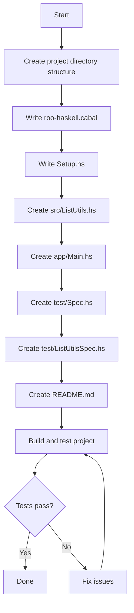

# Haskell Project Plan: roo-haskell

## Overview

Create a Haskell project named `roo-haskell` with:
- Cabal build system
- A focused list utility library with 5 core functions
- HSpec testing framework with hspec-discover for automatic test discovery
- Comprehensive QuickCheck property-based testing

## Project Structure

```
roo-haskell/
├── roo-haskell.cabal          # Cabal build configuration
├── Setup.hs                    # Standard Cabal setup
├── src/
│   └── ListUtils.hs           # Main library module
├── app/
│   └── Main.hs                # Executable entry point
├── test/
│   ├── Spec.hs                # hspec-discover entry point
│   └── ListUtilsSpec.hs       # Tests for ListUtils module
└── README.md                  # Project documentation
```

## Component Details

### 1. Cabal Configuration (roo-haskell.cabal)

The cabal file will define:
- **Library**: Exposes `ListUtils` module
- **Executable**: `roo-haskell-exe` that demonstrates the library
- **Test Suite**: Uses hspec-discover for automatic test discovery

Dependencies:
- `base >= 4.7 && < 5`
- `hspec` (testing framework)
- `hspec-discover` (automatic test discovery)
- `QuickCheck` (property-based testing)

### 2. Library Module: ListUtils.hs

**Simplified to 6 core functions** demonstrating filter, map, and fold patterns:

```haskell
module ListUtils
  ( safeHead
  , safeLast
  , filterBy
  , sumList
  , reverseList
  , mapDouble
  ) where
```

| Function | Description | Type Signature |
|----------|-------------|----------------|
| `safeHead` | Safe version of head returning Maybe | `[a] -> Maybe a` |
| `safeLast` | Safe version of last returning Maybe | `[a] -> Maybe a` |
| `filterBy` | Generic filter with predicate | `(a -> Bool) -> [a] -> [a]` |
| `sumList` | Sum all elements using fold | `Num a => [a] -> a` |
| `reverseList` | Reverse list using fold | `[a] -> [a]` |
| `mapDouble` | Double each element in a numeric list | `Num a => [a] -> [a]` |

### 3. Executable: Main.hs

A simple demonstration program that:
- Shows examples of each list utility function
- Prints results to console

### 4. Test Suite

#### Spec.hs (hspec-discover entry point)
```haskell
{-# OPTIONS_GHC -F -pgmF hspec-discover #-}
```

#### ListUtilsSpec.hs - Comprehensive Testing

**Unit Tests (HSpec) - 15+ test cases:**

For `safeHead`:
- Empty list returns `Nothing`
- Single element list returns `Just` that element
- Multi-element list returns `Just` first element
- Works with different types (Int, String, Bool)

For `safeLast`:
- Empty list returns `Nothing`
- Single element list returns `Just` that element
- Multi-element list returns `Just` last element
- Works with different types (Int, String, Bool)

For `filterBy`:
- Filter with `even` predicate on known list
- Filter with `odd` predicate on known list
- Filter with `(> 0)` predicate
- Filter with always-true predicate returns original
- Filter with always-false predicate returns empty

For `sumList`:
- Empty list returns 0
- Single element returns that element
- Known list returns expected sum
- Negative numbers handled correctly

For `reverseList`:
- Empty list returns empty
- Single element returns same
- Known list returns expected reverse

For `mapDouble`:
- Empty list returns empty
- Known list returns doubled values

**Property Tests (QuickCheck) - 12+ properties:**

| Property | Description |
|----------|-------------|
| `prop_safeHeadEmpty` | `safeHead []` always equals `Nothing` |
| `prop_safeHeadNonEmpty` | `safeHead` of non-empty list equals `Just (head xs)` |
| `prop_safeHeadSingleton` | `safeHead [x]` equals `Just x` |
| `prop_safeLastEmpty` | `safeLast []` always equals `Nothing` |
| `prop_safeLastNonEmpty` | `safeLast` of non-empty list equals `Just (last xs)` |
| `prop_safeLastSingleton` | `safeLast [x]` equals `Just x` |
| `prop_safeHeadLastSymmetry` | `safeHead xs == safeLast (reverse xs)` |
| `prop_filterByLength` | Filtered list length <= original length |
| `prop_filterByTrue` | `filterBy (const True)` returns original list |
| `prop_filterByFalse` | `filterBy (const False)` returns empty list |
| `prop_filterByAllMatch` | All elements in result satisfy predicate |
| `prop_sumListEmpty` | Sum of empty list is 0 |
| `prop_sumListSingleton` | Sum of `[x]` equals `x` |
| `prop_sumListConcatenation` | `sumList (xs ++ ys) == sumList xs + sumList ys` |
| `prop_reverseReverse` | Reversing twice gives original list |
| `prop_reverseLength` | Reverse preserves length |
| `prop_reverseHead` | Head of reversed list equals last of original |
| `prop_mapDoubleLength` | `mapDouble` preserves length |
| `prop_mapDoubleValues` | Each element is doubled: `mapDouble xs !! i == 2 * xs !! i` |
| `prop_mapDoubleEmpty` | `mapDouble []` equals `[]` |

## Workflow Diagram



## Build and Test Commands

```bash
# Build the project
cabal build

# Run the executable
cabal run roo-haskell-exe

# Run tests
cabal test

# Run tests with verbose output
cabal test --test-show-details=direct
```

## Files to Create

1. `roo-haskell.cabal` - Cabal build configuration
2. `Setup.hs` - Standard Cabal setup script
3. `src/ListUtils.hs` - Library module with list utilities
4. `app/Main.hs` - Executable demonstrating the library
5. `test/Spec.hs` - hspec-discover entry point
6. `test/ListUtilsSpec.hs` - HSpec and QuickCheck tests
7. `README.md` - Project documentation

## Next Steps

After approval, switch to Code mode to implement all files according to this plan.
