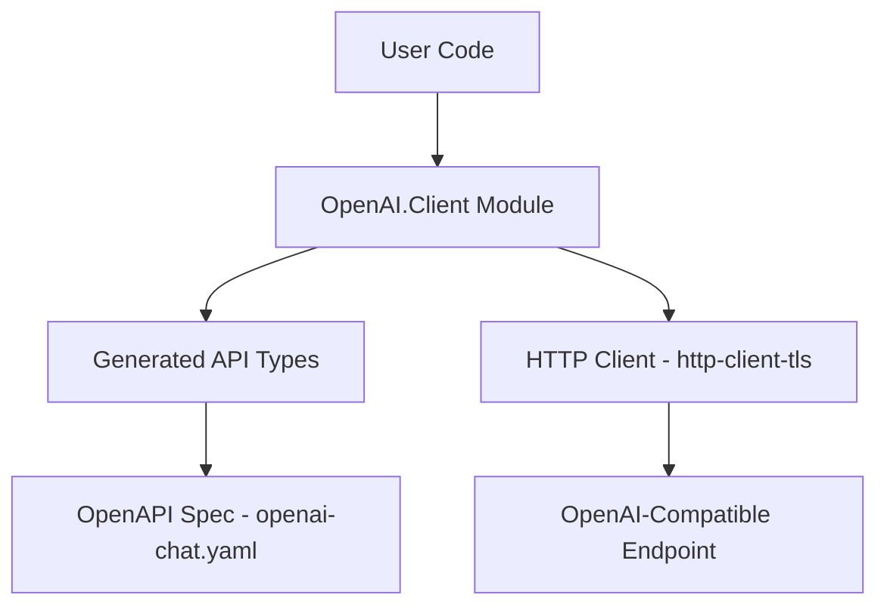

# OpenAI-Compatible API Integration Plan

## Overview

Add support for making API calls to OpenAI-compatible endpoints in the roo-haskell project. This includes generating client code from an OpenAPI specification and providing a simple integration test.

## Requirements Summary

- **OpenAPI Spec**: Minimal spec covering only `/v1/chat/completions` endpoint
- **Code Generator**: `openapi3-code-generator` (Haskell-native)
- **Configuration**: Function parameters for API endpoint URL and API key
- **Compatibility**: Any OpenAI-compatible endpoint (OpenAI, Ollama, LM Studio, vLLM, etc.)
- **Testing**: Integration test with real API calls
- **Dependencies**: Conservative and minimal

## Architecture



## Detailed Implementation Plan

### 1. Create OpenAPI Specification

**File**: `openapi/openai-chat.yaml`

Create a minimal OpenAPI 3.0 specification that defines:

- **Endpoint**: `POST /v1/chat/completions`
- **Request Schema**: `ChatCompletionRequest`
  - `model` (string, required): Model identifier
  - `messages` (array, required): Array of message objects
    - `role` (string): "system", "user", or "assistant"
    - `content` (string): Message content
  - `temperature` (number, optional): Sampling temperature
  - `max_tokens` (integer, optional): Maximum tokens to generate
  - `stream` (boolean, optional): Whether to stream responses (default: false)
- **Response Schema**: `ChatCompletionResponse`
  - `id` (string): Unique identifier
  - `object` (string): Object type
  - `created` (integer): Unix timestamp
  - `model` (string): Model used
  - `choices` (array): Array of completion choices
    - `index` (integer): Choice index
    - `message` (object): Response message
    - `finish_reason` (string): Why generation stopped
  - `usage` (object, optional): Token usage statistics

### 2. Generate Haskell Client Code

Use `openapi3-code-generator` to generate type-safe Haskell code:

```bash
# Install the generator (if not already installed)
cabal install openapi3-code-generator

# Generate code from the spec
openapi3-code-generator-exe \
  --specification openapi/openai-chat.yaml \
  --output-dir src/generated \
  --module-name OpenAI.Generated
```

**Generated Files** (in `src/generated/`):
- Type definitions for request/response schemas
- API operation functions
- JSON serialization instances

### 3. Create Wrapper Module

**File**: `src/OpenAI/Client.hs`

A high-level wrapper module providing:

```haskell
module OpenAI.Client
  ( -- * Configuration
    OpenAIConfig(..)
  , defaultConfig
    -- * API Operations
  , chatCompletion
  , ChatMessage(..)
  , Role(..)
    -- * Response Types
  , ChatCompletionResponse(..)
  , Choice(..)
  ) where
```

Key functions:
- `chatCompletion :: OpenAIConfig -> ChatCompletionRequest -> IO (Either Error ChatCompletionResponse)`
- Configuration via `OpenAIConfig` record with `baseUrl` and `apiKey` fields

### 4. Update Cabal Dependencies

**Minimal dependencies to add**:

```cabal
build-depends:
    -- Existing
    base >= 4.7 && < 5,
    -- New (minimal set)
    aeson >= 2.0,           -- JSON parsing
    http-client >= 0.7,     -- HTTP client
    http-client-tls >= 0.3, -- TLS support
    http-types >= 0.12,     -- HTTP types
    text >= 1.2,            -- Text handling
    bytestring >= 0.10      -- ByteString handling
```

**Note**: The `openapi3-code-generator` is only needed as a build tool, not a runtime dependency.

### 5. Create Integration Test

**File**: `test/OpenAIClientSpec.hs`

Integration test that:
1. Reads API configuration from environment or uses defaults
2. Makes a real API call to the configured endpoint
3. Verifies the response structure is valid

```haskell
spec :: Spec
spec = describe "OpenAI.Client" $ do
  describe "chatCompletion" $ do
    it "successfully completes a simple chat request" $ do
      -- Test with real API call
      -- Requires OPENAI_API_KEY and optionally OPENAI_BASE_URL
```

**Test Configuration**:
- `OPENAI_API_KEY`: Required for test to run
- `OPENAI_BASE_URL`: Optional, defaults to `https://api.openai.com`
- Test should be skipped gracefully if API key is not set

### 6. Update README

Add documentation section covering:
- How to configure the API client
- Example usage code
- How to run integration tests
- Compatibility notes for different providers

## File Structure After Implementation

```
roo-haskell/
├── openapi/
│   └── openai-chat.yaml          # OpenAPI specification
├── src/
│   ├── ListUtils.hs              # Existing
│   ├── OpenAI/
│   │   └── Client.hs             # High-level wrapper
│   └── generated/                # Generated code (gitignored or committed)
│       └── OpenAI/
│           └── Generated.hs
├── test/
│   ├── Spec.hs                   # Existing
│   ├── ListUtilsSpec.hs          # Existing
│   └── OpenAIClientSpec.hs       # New integration test
└── roo-haskell.cabal             # Updated with new dependencies
```

## Dependency Analysis

### Required Runtime Dependencies

| Package | Purpose | Size Impact |
|---------|---------|-------------|
| `aeson` | JSON serialization | Medium (but commonly used) |
| `http-client` | HTTP requests | Small |
| `http-client-tls` | TLS/HTTPS support | Small |
| `http-types` | HTTP type definitions | Minimal |
| `text` | Text handling | Small (often already a transitive dep) |
| `bytestring` | Binary data | Minimal (usually already present) |

### Build-time Only

| Package | Purpose |
|---------|---------|
| `openapi3-code-generator` | Generate Haskell code from OpenAPI spec |

## Implementation Approach

We will use `openapi3-code-generator` to generate Haskell client code from the OpenAPI specification. The generated code will be committed to the repository to avoid requiring the generator at build time for end users.

### Code Generation Workflow

1. Create the OpenAPI spec at `openapi/openai-chat.yaml`
2. Run `openapi3-code-generator-exe` to generate types and API functions
3. Create a wrapper module for simplified usage
4. Commit the generated code to version control

### Generated Code Structure

The generator will produce:
- **Type definitions** for request/response schemas with Aeson instances
- **API operation functions** using http-client
- **Configuration types** for base URL and authentication

## Execution Checklist

1. [ ] Create `openapi/openai-chat.yaml` with the chat completions endpoint spec
2. [ ] Install `openapi3-code-generator` via cabal
3. [ ] Generate code to `src/OpenAI/Generated/`
4. [ ] Create `src/OpenAI/Client.hs` wrapper module
5. [ ] Update `roo-haskell.cabal` with new modules and dependencies
6. [ ] Create `test/OpenAIClientSpec.hs` integration test
7. [ ] Update `README.md` with API documentation
8. [ ] Test with a real OpenAI-compatible endpoint
